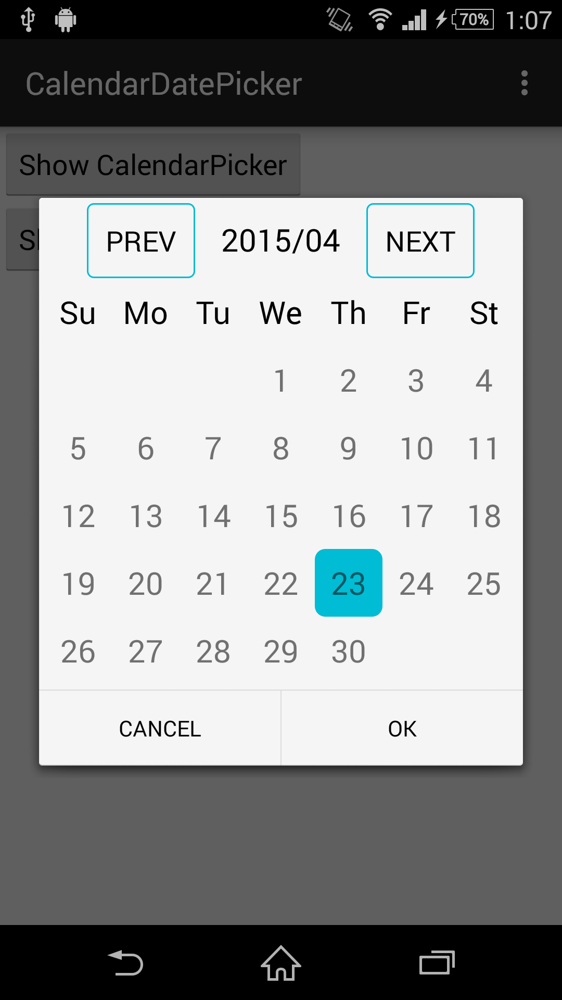

# CalendarPicker
Library of date picker dialog for Android

##Usage
Import /calendarpicker as a module
```java
CalendarPicker calendarPicker = new CalendarPicker();
calendarPicker.setDateSelectedListenr(new DateSelectedListener() {
    @Override
    public void onDateSelectedListener(int year, int month, int dayOfMonth) {
        String date = "" + year+ "/" + month + "/" + dayOfMonth;
        Toast.makeText(getApplicationContext(),date,Toast.LENGTH_SHORT).show();
    }
});
calendarPicker.show(getSupportFragmentManager(),"calendar");
```
##Screenshots
<p>
    
    
    
</p>

